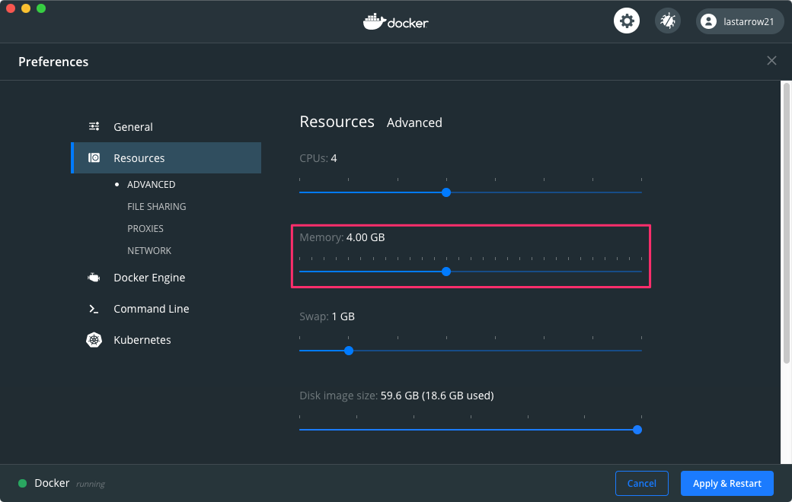

# Study FaaS with Kotlin-Native 2
[1 is here](https://github.com/lasta/study-faas-kotlin).

## TODO
- [x] migrate from `build.gradle` to `build.gradle.kts`
- [x] run "Hello, World!"
  - [x] on mac
  - [x] on Amazon Linux 2
- [x] cross-compile for platforms
- [x] mark project structure automatically by IntelliJ IDEA
- [x] clean up `build.gradle.kts`
  - [x] create `buildSrc`
    - [sample][create buildSrc]
  - [ ] unit-test in buildSrc scripts
  - [ ] generate "executables" automatically
- [ ] arrange source directory structure
  - do refactor `me/lasta/studyfaaskotlin2/entrypoint/withbootstrap/main.kt`
- [x] import JSON serializer
  - [x] use stringify
    - [`Json.encodeToSting`][kotlinx.serialization]
  - [x] use deserializer
    - [`Json.decodeFromString<Clazz>(string)`][kotlinx.serialization]
- [x] import ktor
  - [x] use HTTP Client
    - [`ktor-client-cio`][ktor-client-cio]
    - `ktor-client-curl`
  - [x] https
    - use `Curl` client instead
- [ ] import DI library
  - kodein?
- [ ] on IntelliJ IDEA
  - [ ] run
  - [ ] debug
  - [ ] unit test
  - ~~sam local (AWS Serverless Application Model)~~
    - runtime "provided" is unsupported
- [x] sam local (AWS Serverless Application Model)
- [ ] create bootstrap klib and lambda layer to reduce compile time
- [ ] deploy
- [ ] create API test
  - [ ] [preacher][preacher]
- [ ] O/R mapper

[example to build at once]: https://github.com/JetBrains/kotlin/blob/1.3.20/libraries/tools/kotlin-gradle-plugin-integration-tests/src/test/resources/testProject/new-mpp-native-binaries/kotlin-dsl/build.gradle.kts
[create buildSrc]: https://www.itcowork.co.jp/blog/?p=5357
[preacher]: https://github.com/ymoch/preacher
[kotlinx.serialization]: https://github.com/Kotlin/kotlinx.serialization#introduction-and-references

## Run on the AWS SAM Local CLI
### Setup
1. Install [Homebrew][Homebrew]
2. Install AWS CLI2
```sh
brew tap aws/tap
brew install aws-sam-cli
```

### Create build environment
1. Clone this repository and change directory there
2. Build image to build gradle environment on Amazon Linux 2
```sh
docker build -t gradle-on-amazonlinux2:1.0 .
```

### Build
```sh
docker run --memory=3g -v "$(pwd)":/root/faas -t gradle-on-amazonlinux2:1.0 /root/faas/gradlew -p /root/faas/ clean build
cp build/bin/native/helloReleaseExecutable/main.kexe sam/bootstrap
```

#### Note. Development continuously
```shell script
docker run --memory=3g -v "$(pwd)":/root/faas -itd gradle-on-amazonlinux2:1.0
docker exec -it $(docker ps | grep 'gradle-on-amazonlinux' | awk '{print $1}') /root/faas/gradlew -p /root/faas/ clean build
# TODO: fix path
cp build/bin/native/helloReleaseExecutable/main.kexe sam/bootstrap
```

#### Note. OOME
Docker for Mac restricts memory 2GB, but compiling kotlin native takes much memory.
If compiler raises 137 error, it may occur OOME.
If it occurs, you should configure memory size.



### Run
1. Run SAM local api
```sh
sam local start-api -t sam/template.yaml
```
2. Request
```shell script
curl http://localhost:3000/withbootstrap
```

#### Note. Install manually
```sh
# on container (amazonlinux:2)
amazon-linux-extras enable corretto8
yum clean metadata
yum -y install \
  java-1.8.0-amazon-corretto-devel \          # for gradle
  which zip unzip \                           # for sdkman
  tar gcc gcc-c++ make ncurses-compat-libs \  # for kotlin/native
  libcurl-devel openssl-devel                 # for ktor-client-curl
curl -s http://get.sdkman.io | bash
sh /root/.sdkman/bin/sdkman-init.sh
source /root/.bashrc
sdk install gradle
```

* [Install Gradle on Amazon Linux][install gradle on amazon linux]

[install gradle on amazon linux]: https://hacknote.jp/archives/16618/

<!-- FIXME: described below is for study-faas-kotlin (1). 
            should be adapted for 2.
### Test
#### on Mac
```console
$ ./gradlew allTests

> Configure project :
Kotlin Multiplatform Projects are an experimental feature.

BUILD SUCCESSFUL in 1s
8 actionable tasks: 2 executed, 6 up-to-date
```

## Example server
The API server to test client.

### Run the server
```console
$ ./gradlew ":etc:example:server:run"
```

See also [server's README.md](etc/example/server/README.md).
-->

[Homebrew]: https://brew.sh/
[Installing the AWS Toolkit for JetBrains]: https://docs.aws.amazon.com/toolkit-for-jetbrains/latest/userguide/setup-toolkit.html
[Installing the AWS SAM CLI]: https://docs.aws.amazon.com/serverless-application-model/latest/developerguide/serverless-sam-cli-install.html
